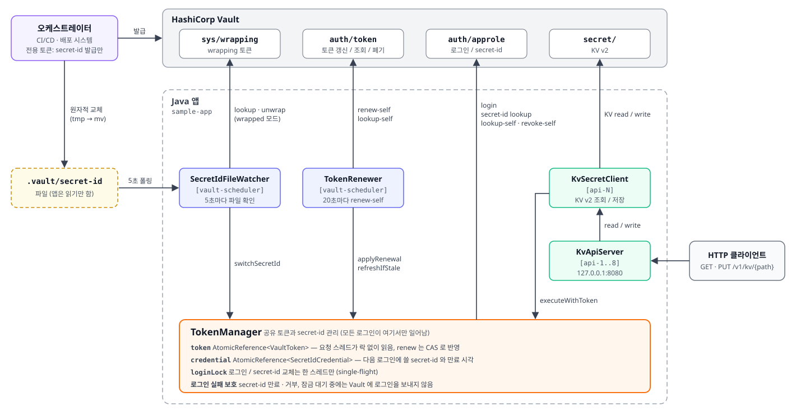
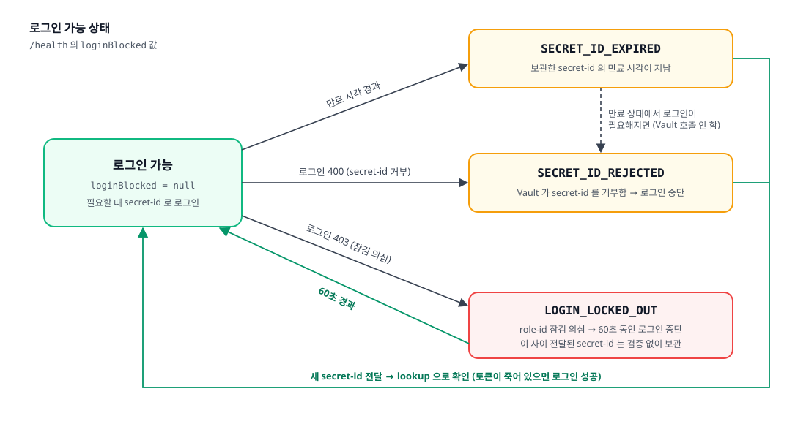

# Vault AppRole 연동 개발 가이드

이 문서는 Vault AppRole 샘플 앱을 이어받아 개발하거나, 운영 코드로 옮기려는 개발자를 위한 가이드입니다. 아래 내용을 다룹니다.

- 왜 이렇게 설계했는지 (고려사항, 결정 과정)
- 어떤 순서로 무엇을 바꿨는지 (작업 이력)
- 실제로 어떻게 돌아가는지 (동작 로직, 동시성)
- 실패했을 때 어떻게 되는지 (예외/에러 처리, 장애 시나리오)


| 관련 문서                                    | 내용                                           |
| ---------------------------------------- | -------------------------------------------- |
| [README.md](../README.md)                | 빠른 시작, API 사용법, 설정 값                         |
| [VAULT_API_GUIDE.md](VAULT_API_GUIDE.md) | Java 함수별 Vault HTTP API와 실제 request/response |


---


## 1. 개요


### 1.1 앱이 하는 일

- **AppRole로 Vault에 인증**하고, 받은 토큰 하나를 여러 스레드가 함께 씁니다.
- 기동한 뒤에는 **HTTP API 요청을 기다리며 대기**합니다. 요청이 오면 KV v2 시크릿을 읽거나 저장합니다.
- 토큰은 **Vault periodic 토큰으로 받아 주기적으로 갱신**하며 계속 씁니다. 재로그인하지 않습니다.
- **secret-id는 앱이 만들지 않습니다.** 신뢰된 오케스트레이터가 파일로 전달하고, 앱은 조회(lookup)로 유효성을 확인한 뒤 보관합니다.


### 1.2 기술 스택


| 구분       | 사용                                           | 비고                          |
| -------- | -------------------------------------------- | --------------------------- |
| 언어 / 빌드  | Java 17, Maven (shade 플러그인으로 fat-jar)        |                             |
| Vault 호출 | `java.net.http.HttpClient` (JDK 내장)          | **Vault SDK 미사용** (2.1절 D1) |
| API 서버   | `com.sun.net.httpserver.HttpServer` (JDK 내장) |                             |
| JSON     | Jackson databind 2.17                        |                             |
| 로그       | SLF4J + slf4j-simple                         | 시간, 스레드명 출력                 |
| 테스트 환경   | Vault OSS 2.1.1 dev 모드 (Docker)              |                             |


---


## 2. 설계 고려사항과 결정


### D1. Vault SDK를 쓰지 않고 HTTP API를 직접 호출


| 항목      | 내용                                                                                                              |
| ------- | --------------------------------------------------------------------------------------------------------------- |
| 선택지     | Spring Vault / vault-java-driver / JDK HttpClient 직접 호출                                                         |
| 결정      | JDK HttpClient로 직접 호출                                                                                           |
| 이유      | POC의 목적이 인증 흐름을 검증하고 설명하는 것이어서, 어떤 API를 어떤 토큰으로 호출하는지가 코드에 그대로 보여야 했습니다. 의존성도 Jackson과 SLF4J만 있으면 됩니다.          |
| 운영 전환 시 | Spring 환경이라면 Spring Vault 사용을 검토하세요. 다만 이 문서의 로직(로그인 보호, lookup 검증, 오케스트레이터 파일 감시)은 SDK가 해 주지 않으므로 그대로 옮겨야 합니다. |


### D2. 토큰 하나를 여러 스레드가 공유


| 항목             | 내용                                                                                                                                                                                                                                                                                                                                        |
| -------------- | ----------------------------------------------------------------------------------------------------------------------------------------------------------------------------------------------------------------------------------------------------------------------------------------------------------------------------------------- |
| 멀티 스레드가 필요한 이유 | 토큰은 period 안에 갱신(renew)하지 않으면 만료됩니다. 그런데 앱은 요청이 올 때까지 대기하므로, 갱신을 요청 처리 흐름에 붙이면 요청이 없는 동안 토큰이 만료됩니다. 그래서 요청과 상관없이 정해진 주기로 토큰을 갱신하는 **백그라운드 스레드**(`vault-scheduler`)가 따로 있어야 합니다. 이 스레드는 요청 처리 스레드(`api-N`)와도 분리해야 합니다. 그래야 요청이 몰리거나 느린 요청이 있어도 갱신이 밀려 토큰이 만료되는 일이 없습니다. 결국 갱신 스레드와 여러 요청 스레드가 같은 토큰을 동시에 읽고 쓰게 되므로, 아래와 같은 공유 구조가 필요합니다. |
| 문제             | 요청 스레드가 많을 때, 토큰을 읽느라 서로 막히면 안 됩니다. 반대로 토큰이 무효가 되었을 때 모든 스레드가 동시에 재로그인하면 토큰이 여러 개 발급되고, 실패 횟수도 쌓입니다.                                                                                                                                                                                                                                      |
| 결정             | 읽기는 `AtomicReference`로 락 없이 합니다. 로그인과 secret-id 교체는 `ReentrantLock`으로 한 스레드만 하게 합니다(single-flight). 갱신(renew)은 같은 토큰의 TTL만 바뀌므로 CAS로 반영합니다.                                                                                                                                                                                               |
| 상세             | 6장                                                                                                                                                                                                                                                                                                                                        |


### D3. secret-id 발급 주체: 앱 → 오케스트레이터


| 항목    | 내용                                                                                               |
| ----- | ------------------------------------------------------------------------------------------------ |
| 처음 설계 | 앱 정책에 자기 role의 `secret-id` 발급 권한을 주고, 앱이 주기적으로 새로 발급했습니다.                                        |
| 문제    | 앱 토큰이 유출되면 그 토큰으로 secret-id도 새로 만들 수 있습니다. 공격자가 영구적으로 다시 로그인할 수단을 얻게 됩니다.                        |
| 결정    | **Trusted Orchestrator 패턴**으로 바꿨습니다. 오케스트레이터는 전용 토큰으로 secret-id를 발급해 파일로 전달하고, 앱은 그 파일을 읽기만 합니다. |
| 결과    | 앱 토큰으로 secret-id를 발급하면 403이 납니다. 오케스트레이터 토큰으로 KV를 읽어도 403이 납니다. 둘 다 테스트로 확인했습니다.                 |


### D4. Response wrapping은 선택 기능으로 지원


| 항목     | 내용                                                                                                                  |
| ------ | ------------------------------------------------------------------------------------------------------------------- |
| 이유     | 전달하는 경로(파일, 배포 시스템)에 secret-id 원문이 남지 않게 하고, 누가 중간에 열어 봤는지 알 수 있게 하려는 것입니다.                                         |
| 구현     | 오케스트레이터가 `X-Vault-Wrap-TTL` 헤더로 1회용 wrapping 토큰을 받아 전달합니다. 앱은 `sys/wrapping/lookup`으로 **생성 경로**를 확인한 뒤 `unwrap`합니다. |
| 트레이드오프 | wrapping 토큰은 한 번만 풀 수 있습니다. 그래서 앱을 재시작할 때는 오케스트레이터가 새 토큰을 다시 전달해야 합니다. 기본값은 원문 모드입니다.                               |


### D5. 토큰 수명: max_ttl 재로그인 → periodic 토큰


| 항목        | 내용                                                                                                                                    |
| --------- | ------------------------------------------------------------------------------------------------------------------------------------- |
| 처음 설계     | 일반 토큰(`token_ttl=60s`, `token_max_ttl=3m`)을 쓰고, max_ttl에 도달하면 secret-id로 재로그인했습니다.                                                    |
| 문제        | "한 번 받은 토큰을 갱신하며 쓴다"는 구조와 맞지 않았습니다. 3분마다 secret-id가 필요해서, secret-id 전달이 끊기면 곧바로 장애로 이어졌습니다.                                           |
| 결정        | role에 `token_period`를 설정해 **periodic 토큰**을 받습니다. period 안에 renew하기만 하면 무한정 연장됩니다(테스트로 확인).                                            |
| 남겨 둔 안전장치 | role 설정이 잘못되어 periodic이 아니면, max_ttl에 가까워졌을 때 재로그인하는 경로가 아직 동작합니다. 앱은 시작할 때 `lookup-self`로 period를 확인하고, periodic이 아니면 WARN 로그를 남깁니다. |


### D6. 새 secret-id 검증: 로그인 → 조회(lookup)


| 항목    | 내용                                                                                                         |
| ----- | ---------------------------------------------------------------------------------------------------------- |
| 처음 설계 | 전달받은 secret-id로 실제 로그인해 보고, 성공하면 토큰까지 함께 교체했습니다.                                                           |
| 문제    | 전달될 때마다 토큰이 바뀌어 D5의 의도와 맞지 않았습니다. 잘못된 secret-id가 반복해서 전달되면 로그인 실패도 쌓였습니다.                                  |
| 결정    | 앱 정책에 `secret-id/lookup` 권한만 추가했습니다. 이 권한으로는 secret-id를 만들 수 없습니다. 토큰이 살아 있으면 조회로만 검증하고 보관하며, 토큰은 그대로 둡니다. |
| 예외    | 토큰이 죽어 있으면 조회할 수 없으므로, 그때만 새 secret-id로 로그인합니다. 이 로그인이 검증과 복구를 겸합니다.                                       |


### D7. 로그인 실패 보호

**발생한 일**

1. secret-id(TTL 5분)를 다시 전달하는 오케스트레이터가 돌고 있지 않은 상태에서, max_ttl 재로그인 시점이 왔습니다. secret-id가 이미 만료되어 `400 invalid role or secret ID`가 났습니다.
2. 앱이 거부된 secret-id로 20초마다 재로그인을 다시 시도했습니다.
3. 실패가 5번 쌓이자 Vault의 **user lockout**이 role-id를 15분 동안 잠갔습니다.
4. 그 뒤로는 올바른 secret-id로도 `403 permission denied`가 났습니다. 새 secret-id가 와도 회복할 수 없는 상태가 된 것입니다.

**결정**: 실패할 것이 확실한 로그인은 Vault에 보내지 않습니다.


| 조건                            | 처리                                                          |
| ----------------------------- | ----------------------------------------------------------- |
| 조회로 기록해 둔 secret-id 만료 시각이 지남 | 로그인하지 않음                                                    |
| 로그인이 400 (secret-id 거부)       | 새 secret-id가 올 때까지 로그인하지 않음                                 |
| 로그인이 403 (잠김 의심)              | 60초 동안 로그인하지 않음. 그 사이 전달된 secret-id는 검증 없이 보관했다가 대기가 끝나면 사용 |


### D8. 403의 두 가지 의미를 구분


| 항목  | 내용                                                                                                                              |
| --- | ------------------------------------------------------------------------------------------------------------------------------- |
| 문제  | Vault는 토큰이 무효(만료/폐기)인 경우와 정책상 권한이 없는 경우 모두 403을 줍니다. 정책 문제인데 매번 재로그인하면, 허용되지 않은 경로로 요청이 들어올 때마다 토큰이 새로 발급됩니다.                   |
| 결정  | 403을 받으면 `lookup-self`로 토큰이 유효한지 확인합니다. 유효하면 정책 문제이므로 그대로 403을 돌려주고, 무효일 때만 재로그인합니다.                                            |
| 참고  | 오류 메시지도 다르긴 합니다(무효: `permission denied` + `invalid token`, 정책: `permission denied`). 하지만 메시지 문구는 Vault 버전에 따라 바뀔 수 있어서 쓰지 않습니다. |


### D9. 이전 토큰은 바로 폐기하지 않고 잠시 기다림

재로그인으로 토큰을 바꾼 직후 이전 토큰을 폐기하면, 그 토큰으로 요청 중이던 스레드가 실패합니다. 그래서 이전 토큰은 `OLD_TOKEN_REVOKE_GRACE_SEC`(5초) 뒤에 `revoke-self`로 폐기합니다. 앱이 종료될 때는 현재 토큰을 즉시 폐기합니다.

### D10. 파일 감시는 WatchService 대신 폴링

오케스트레이터는 임시 파일에 쓴 뒤 `mv`로 바꿔치기합니다. Kubernetes secret 볼륨은 심볼릭 링크를 교체합니다. 이런 방식은 OS마다 `WatchService` 이벤트가 다르게 오거나 오지 않을 수 있습니다. 그래서 5초마다 파일 내용을 읽어서, 마지막으로 처리한 내용과 비교합니다.

### D11. API 서버는 JDK 내장 서버, 인증 없음, 127.0.0.1 바인딩

POC 범위에서 의존성을 늘리지 않으려고 JDK `HttpServer`를 썼습니다. API 자체에 인증이 없고 응답에 시크릿 원문이 들어가므로, 기본으로 127.0.0.1에만 바인딩합니다. 운영에서는 반드시 앞단에 인증을 두어야 합니다(8장).

---


## 3. 작업 이력


| 단계                   | 변경                                                                                             | 주요 파일                                                              | 검증                                                               |
| -------------------- | ---------------------------------------------------------------------------------------------- | ------------------------------------------------------------------ | ---------------------------------------------------------------- |
| 1. 기본 앱              | AppRole 로그인, KV 조회 워커(멀티쓰레드), 앱이 secret-id를 30초마다 발급·교체·이전 것 폐기, Vault dev 컨테이너와 setup 스크립트    | `TokenManager`, `SecretIdRotator`(삭제됨), `SecretWorker`             | 10초 주기 교체 중에도 조회가 끊기지 않음. 토큰 강제 폐기 후 재로그인 1회                     |
| 2. API + 토큰 갱신       | KV 조회/저장 HTTP API, `/health`, `TokenRenewer`(renew-self, max_ttl 근접 시 재로그인), 403 구분(D8), 경로 검증 | `KvApiServer`, `KvSecretClient`, `TokenRenewer`                    | 동시 요청 100건 모두 200. 정책 밖 경로 요청 시 재로그인 0회. max_ttl 재로그인 동작         |
| 3. 오케스트레이터           | 앱에서 secret-id 발급 코드와 권한 제거, 파일 감시, 오케스트레이터 스크립트와 전용 정책, wrapping 지원                            | `SecretIdFileWatcher`, `deliver-secret-id.sh`                      | 권한 분리 403 확인. wrapping 가로채기·위조 거부                                |
| 4. 로그인 보호            | 로그인 잠김 장애 대응(D7), `LoginUnavailableException`(503), `/health`에 `DOWN`과 `loginBlocked` 표시       | `TokenManager`, `LoginUnavailableException`                        | secret-id 거부 시 실패 1회만, 잠기지 않음. 잠긴 상태에서 새 secret-id를 보관했다가 회복     |
| 5. periodic + lookup | `token_period` 설정, `secret-id/lookup`으로 검증(토큰 유지), 만료 시각으로 로그인 판단                              | `SecretIdLookup`, `TokenManager`, `TokenRenewer`, `setup-vault.sh` | period를 넘겨도 같은 토큰 사용. 만료 후 장애 시 로그인을 보내지 않고 503, 새 secret-id로 복구 |


---


## 4. 아키텍처


### 4.1 구성도




### 4.2 클래스


| 클래스                                            | 책임                                                  | 상태                          |
| ---------------------------------------------- | --------------------------------------------------- | --------------------------- |
| `App`                                          | 컴포넌트 조립, 스레드 기동, 종료 처리                              | -                           |
| `VaultConfig`                                  | 환경변수 → 설정 (필수 값 검증)                                 | 불변                          |
| `VaultHttpClient`                              | Vault HTTP 호출, 헤더, JSON, 오류 → `VaultException`      | 없음 (스레드 세이프)                |
| `AppRoleAuthenticator`                         | role-id + secret-id 로그인                             | 없음                          |
| `TokenManager`                                 | 토큰/secret-id 보관, 로그인, 재로그인, secret-id 교체, 로그인 실패 보호 | **공유 상태 보유**                |
| `TokenRenewer`                                 | 토큰 주기 갱신, periodic 확인                               | 없음                          |
| `SecretIdFileWatcher`                          | secret-id 파일 감시, unwrap                             | `lastContent` (스케줄러 스레드 전용) |
| `SecretIdLookup`                               | secret-id 조회 (존재 여부, 만료 시각)                         | 없음                          |
| `KvSecretClient`                               | KV v2 조회/저장                                         | 없음                          |
| `KvApiServer`                                  | HTTP API, 경로 검증, 오류 → 응답 코드                         | 없음                          |
| `VaultToken`, `SecretIdCredential`, `KvSecret` | 값 객체 (record)                                       | 불변                          |


### 4.3 스레드


| 스레드                 | 개수                   | 하는 일                               |
| ------------------- | -------------------- | ---------------------------------- |
| `main`              | 1                    | 기동 후 종료 신호 대기                      |
| `api-N`             | `API_THREADS` (8)    | HTTP 요청 처리                         |
| `vault-scheduler-N` | 2                    | 토큰 갱신(20초), 파일 감시(5초), 이전 토큰 지연 폐기 |
| `worker-N`          | `WORKER_THREADS` (0) | (선택) 백그라운드 부하용 KV 조회               |
| `shutdown`          | 1                    | Ctrl+C / SIGTERM 시 정리              |


스케줄러를 API 스레드 풀과 분리한 이유는, 요청이 몰려도 갱신 작업이 밀려서 토큰이 만료되는 일이 없게 하기 위해서입니다.

---


## 5. 동작 로직


### 5.1 기동

```
App.main
 ├─ VaultConfig.fromEnv()                 필수 값 없으면 즉시 실패
 ├─ SecretIdFileWatcher.loadInitial()     파일 읽기 (wrapped면 lookup → unwrap). 없거나 비면 실패
 ├─ TokenManager.initialize()
 │    ├─ login(role-id, secret-id)        실패하면 예외 → 프로세스 종료
 │    └─ secret-id/lookup                 만료 시각 기록 (실패해도 경고만)
 ├─ TokenRenewer.start()                  lookup-self로 periodic 확인 → 20초 주기 예약
 ├─ SecretIdFileWatcher.start()           5초 주기 예약
 ├─ KvApiServer.start()                   127.0.0.1:8080
 └─ 대기 (CountDownLatch)
```

기동 단계의 실패는 모두 **즉시 종료**합니다. 설정이 잘못된 채로 떠 있는 것보다, 배포 단계에서 바로 실패하는 편이 낫기 때문입니다.

### 5.2 API 요청 처리

```
[api-N] KvApiServer.handleKv
 ├─ 경로 검증 (허용 문자, "." / ".." 세그먼트 거부)           실패 → 400
 ├─ 바디 검증 (PUT/POST: JSON 객체, 1MB 이하, 비어 있지 않음)   실패 → 400
 └─ KvSecretClient.read / write
      └─ TokenManager.executeWithToken(call)
           ├─ getToken()            락 없이 읽음. 만료 10초 전이면 refreshIfStale
           ├─ call(token)           성공 → 반환
           └─ 403 수신
                ├─ lookup-self 성공 (토큰 유효) → 정책 거부. 403 그대로 (재로그인 안 함)
                └─ lookup-self 실패 (토큰 무효) → refreshIfStale(token) → call 1회 재시도
```


### 5.3 토큰 갱신 (20초마다)

```
[vault-scheduler] TokenRenewer.renew
 ├─ renew-self
 │    ├─ 200: lease_duration(=period) 로 만료 시각 재계산 → applyRenewal (CAS)
 │    │        CAS 실패 = 그 사이 재로그인으로 토큰이 바뀜 → 결과 버림
 │    ├─ 403: 토큰 무효 → refreshIfStale (장애 복구)
 │    └─ 그 외 오류: ERROR 로그, 다음 주기에 재시도
 └─ (안전장치) lease_duration ≤ 주기+10초 → periodic이 아님 → refreshIfStale
```


### 5.4 새 secret-id 전달 처리 (5초마다 파일 확인)

```
[vault-scheduler] SecretIdFileWatcher.check
 ├─ 파일 내용이 마지막 처리 내용과 같음 → 종료
 ├─ lastContent 갱신  (실패해도 같은 내용으로 다시 시도하지 않음)
 ├─ wrapped면 sys/wrapping/lookup(생성 경로 확인) → unwrap
 └─ TokenManager.switchSecretId(new)          [loginLock]
      ├─ 토큰이 살아 있음 (평소)
      │    └─ secret-id/lookup
      │         ├─ 200 + 만료 전  → 보관 (토큰 유지), "거부됨" 해제
      │         ├─ 200 + 만료됨   → 거부, 기존 유지
      │         ├─ 204           → 거부, 기존 유지
      │         ├─ 403 + 토큰 유효 → 설정 오류(정책에 lookup 권한 없음)
      │         └─ 403 + 토큰 무효 → 아래로
      └─ 토큰이 없거나 죽음 (장애 중)
           ├─ 잠금 대기 중   → 검증 없이 보관
           └─ login(new)
                ├─ 200 → 토큰 교체 (복구) → lookup으로 만료 시각 기록
                ├─ 400 → 거부, 기존 유지
                └─ 403 → 잠금 대기 시작 + 검증 없이 보관
```


### 5.5 장애 복구 (재로그인)

`refreshIfStale(stale)`가 유일한 재로그인 입구입니다. API 요청과 `TokenRenewer` 모두 이곳을 거칩니다.

```
TokenManager.refreshIfStale(stale)            [loginLock]
 ├─ 현재 토큰이 stale과 다르고 아직 유효 → 다른 스레드가 이미 복구함. 현재 토큰 반환
 ├─ checkLoginAllowed()                       ← "secret-id가 유효할 때만 로그인" 관문
 │    ├─ 거부된 secret-id     → LoginUnavailableException (Vault 호출 안 함)
 │    ├─ 만료 시각 지남        → 거부됨으로 표시 + LoginUnavailableException
 │    └─ 잠금 대기 중          → LoginUnavailableException
 └─ login(보관 중인 secret-id)
      ├─ 200 → 토큰 교체, 이전 토큰은 5초 뒤 폐기, 미확인 secret-id면 lookup
      ├─ 400 → 거부됨으로 표시 → LoginUnavailableException
      └─ 403 → 60초 잠금 대기 → LoginUnavailableException
```


### 5.6 로그인 가능 상태



`/health`의 `loginBlocked`가 이 상태를 보여 줍니다. 평소에는 로그인하지 않으므로 `null`이 아니어도 당장 장애는 아닙니다. 하지만 **토큰을 잃으면 복구할 수 없는 상태**입니다.

### 5.7 종료

```
shutdown hook (Ctrl+C / SIGTERM) 또는 RUN_DURATION_SEC 경과
 ├─ KvApiServer.stop()        새 요청 거부, 처리 중인 요청 최대 2초 대기
 ├─ 워커 인터럽트, 최대 5초 대기
 ├─ 스케줄러 중단             (예약된 이전 토큰 폐기도 취소 → 그 토큰은 TTL 만료로 소멸)
 └─ revokeCurrent()           현재 토큰 즉시 revoke-self
```

---


## 6. 동시성 설계


### 6.1 공유 상태


| 필드 (`TokenManager`)  | 타입                                    | 쓰는 쪽                 | 읽는 쪽                | 보호           |
| -------------------- | ------------------------------------- | -------------------- | ------------------- | ------------ |
| `token`              | `AtomicReference<VaultToken>`         | 로그인(락 안), renew(CAS) | 모든 요청 스레드           | 락 + CAS      |
| `credential`         | `AtomicReference<SecretIdCredential>` | 교체, 조회 결과 반영 (락 안)   | 로그인(락 안), `/health` | 락            |
| `credentialRejected` | `volatile boolean`                    | 락 안                  | 락 안, `/health`      | 락 + volatile |
| `loginBlockedUntil`  | `volatile Instant`                    | 락 안                  | 락 안, `/health`      | 락 + volatile |


`VaultToken`과 `SecretIdCredential`은 불변 record입니다. 값을 바꿀 때는 새 인스턴스로 통째로 교체하므로, 읽는 쪽이 반쯤 바뀐 값을 보는 일이 없습니다.

### 6.2 처리하는 경쟁 상황


| 상황                       | 처리                                                                                                                               |
| ------------------------ | -------------------------------------------------------------------------------------------------------------------------------- |
| 여러 스레드가 같은 토큰으로 동시에 403  | 락을 먼저 잡은 스레드만 로그인합니다. 나머지는 "현재 토큰이 stale과 다르다"는 것을 확인하고 새 토큰을 가져갑니다(single-flight). 토큰 강제 폐기 테스트에서 7개 스레드가 403을 받았고 로그인은 1회였습니다. |
| renew 중에 다른 스레드가 재로그인    | renew 결과는 CAS로 반영합니다. 토큰이 이미 바뀌었으면 CAS가 실패하고, renew 결과는 버립니다.                                                                    |
| renew로 인스턴스만 바뀐 뒤 403 판단 | 같은 토큰인지는 인스턴스가 아니라 **토큰 값**으로 비교합니다(`sameTokenAs`).                                                                              |
| secret-id 교체와 재로그인이 동시에  | 둘 다 `loginLock` 안에서 하므로, 재로그인이 반쯤 바뀐 secret-id를 읽는 일이 없습니다.                                                                      |
| 토큰 교체 직후 이전 토큰으로 요청 중    | 이전 토큰은 5초 뒤에 폐기합니다(D9).                                                                                                          |


### 6.3 규칙 (코드를 바꿀 때 지킬 것)

- **Vault에 로그인하는 코드는** `TokenManager` **안에만 둡니다.** 모든 로그인은 `loginLock` 안에서 `login()`을 거쳐야 실패 보호가 적용됩니다.
- **토큰이 필요한 호출은** `executeWithToken`**을 거칩니다.** 그래야 403 구분과 재시도가 적용됩니다.
- **스케줄러 작업은 모든 예외를 잡아야 합니다.** `scheduleWithFixedDelay`는 예외가 한 번 밖으로 나가면 이후 실행을 모두 취소합니다. 지금은 `renewSafely`와 `checkSafely`가 이 역할을 합니다.
- **토큰과 secret-id 원문을 로그에 남기지 않습니다.** 값 객체의 `toString()`은 accessor만 출력합니다.

---


## 7. 예외 및 에러 처리


### 7.1 예외 종류


| 예외                                                  | 의미                                           | 던지는 곳                                                       | 최종 처리                                |
| --------------------------------------------------- | -------------------------------------------- | ----------------------------------------------------------- | ------------------------------------ |
| `VaultException(status)`                            | Vault가 2xx가 아닌 응답을 줌. 응답을 못 받았으면 `status=-1` | `VaultHttpClient`                                           | 호출한 쪽이 상태 코드로 분기                     |
| `LoginUnavailableException` (`VaultException`, 503) | 지금은 로그인할 수 없음. **Vault를 호출하지 않고** 던짐         | `TokenManager`                                              | API는 503, `TokenRenewer`는 WARN 로그    |
| `IllegalStateException`                             | 기동 설정 오류, 전달받은 secret-id 거부, wrapping 검증 실패  | `VaultConfig`, `SecretIdFileWatcher`, `TokenManager.verify` | 기동 중이면 종료, 실행 중이면 ERROR 로그 후 기존 값 유지 |
| `BadRequestException` (내부)                          | 잘못된 API 요청 바디                                | `KvApiServer`                                               | 400                                  |


### 7.2 Vault 응답별 처리


| Vault 응답                          | 호출              | 앱 처리                                                   |
| --------------------------------- | --------------- | ------------------------------------------------------ |
| `400 invalid role or secret ID`   | 로그인             | 기동 중이면 종료. 복구 중이면 secret-id를 거부됨으로 표시하고 **이후 로그인을 멈춤** |
| `403 permission denied`           | 로그인             | user lockout으로 보고 60초 동안 로그인을 멈춤                       |
| `403`                             | 토큰이 필요한 호출      | `lookup-self`로 구분. 토큰 무효면 재로그인 후 1회 재시도, 유효하면 403 그대로  |
| `404`                             | KV 조회           | API 404                                                |
| `204`                             | secret-id 조회    | 존재하지 않음 → 전달받은 secret-id 거부                            |
| `400 wrapping token is not valid` | unwrap / lookup | 가로챘거나 만료된 wrapping 토큰 → 거부                             |
| 네트워크 오류 / 5xx                     | 모든 호출           | API 502. 갱신과 파일 감시는 다음 주기에 다시 시도                       |


### 7.3 API 응답 코드


| 코드  | 원인                                                |
| --- | ------------------------------------------------- |
| 400 | 경로 검증 실패, JSON 객체가 아닌 바디, 1MB 초과, Vault 400       |
| 403 | Vault 정책 거부                                       |
| 404 | 시크릿 없음                                            |
| 405 | GET/PUT/POST 외 메서드                                |
| 502 | Vault 연결 실패, Vault 5xx                            |
| 503 | 토큰이 죽었는데 재로그인할 수 없음 (`LoginUnavailableException`) |
| 500 | 예상하지 못한 예외 (스택 트레이스를 ERROR 로그로 남김)                |


### 7.4 재시도 정책


| 대상                     | 재시도                   | 이유                                          |
| ---------------------- | --------------------- | ------------------------------------------- |
| 토큰 무효로 인한 403          | 재로그인 후 **1회**         | 2회 이상은 대개 토큰이 아니라 정책 문제입니다                  |
| 토큰 갱신 실패               | 다음 주기(20초)            | period(60초) 안에 2~3번 기회가 있습니다                |
| 거부된 secret-id로 로그인     | **재시도하지 않음**          | 실패가 쌓이면 role-id가 잠깁니다(D7)                   |
| 잠김 의심 로그인              | 60초 뒤                 | 잠금 기간(기본 15분) 동안 시도를 줄입니다                   |
| 잘못 전달된 secret-id       | 재시도하지 않음 (다음 전달을 기다림) | wrapping 토큰은 다시 쓸 수 없고, 원문도 같은 값이면 결과가 같습니다 |
| API 요청 중 Vault 네트워크 오류 | 재시도하지 않음 (502)        | 호출한 쪽이 판단하도록 합니다                            |


### 7.5 장애 시나리오별 동작


| 시나리오                            | 감지                                                           | 앱 동작                                        | 복구 방법                      |
| ------------------------------- | ------------------------------------------------------------ | ------------------------------------------- | -------------------------- |
| Vault가 잠시 응답하지 않음 (period보다 짧게) | 갱신 ERROR 로그, API 502                                         | 다음 주기에 갱신 재시도                               | Vault가 돌아오면 자동 복구          |
| Vault 장애가 period보다 김            | 토큰 만료 → 403                                                  | Vault가 돌아오면 보관 중인 secret-id로 재로그인 (만료 전일 때) | 자동. secret-id도 만료됐다면 새로 전달 |
| 관리자가 토큰 강제 폐기                   | 403 + `lookup-self` 실패                                       | 재로그인 1회                                     | 자동                         |
| 오케스트레이터 중단 → secret-id 만료       | `/health` `loginBlocked=SECRET_ID_EXPIRED`                   | 토큰은 계속 갱신하며 정상 동작. 토큰을 잃으면 로그인을 보내지 않고 503  | 오케스트레이터 재가동                |
| 잘못된 secret-id 전달                | ERROR `전달된 secret-id 가 Vault 에 없습니다`                         | 기존 secret-id 유지                             | 올바른 secret-id 다시 전달        |
| wrapping 토큰 가로채기 / 위조           | ERROR `wrapping 토큰이 유효하지 않습니다` / `생성 경로가 다릅니다`               | 기존 secret-id 유지                             | **보안 사고로 조사** 후 다시 전달      |
| role-id 잠김                      | ERROR `AppRole 로그인 403 ...`, `loginBlocked=LOGIN_LOCKED_OUT` | 60초 간격으로만 시도. 전달된 secret-id는 보관             | 15분 대기 또는 관리자 해제 (10.3절)   |
| 앱 정책에 lookup 권한 없음              | ERROR `secret-id 조회 권한이 없습니다`                                | 새 secret-id를 받아들이지 않음                       | 정책에 권한 추가                  |
| periodic이 아닌 role               | 시작 WARN `periodic 토큰이 아닙니다`                                  | max_ttl마다 재로그인 (안전장치)                       | role에 `token_period` 설정    |
| 앱 재시작 (원문 모드)                   | -                                                            | 파일의 secret-id로 로그인                          | 만료 전이면 자동                  |
| 앱 재시작 (wrapped 모드)              | 기동 실패 `wrapping 토큰이 유효하지 않습니다`                               | 종료                                          | 새 wrapping 토큰 전달 후 기동      |
| secret-id 파일 없음 / 읽기 실패         | 기동 시 종료. 실행 중이면 WARN                                         | 실행 중에는 기존 secret-id 유지                      | 파일 복구                      |
| 정책 밖 경로로 API 요청                 | API 403                                                      | 재로그인하지 않음                                   | 정상 동작 (클라이언트 오류)           |


### 7.6 로그 메시지와 조치


| 레벨    | 메시지                                       | 의미                       | 조치                      |
| ----- | ----------------------------------------- | ------------------------ | ----------------------- |
| INFO  | `periodic 토큰 확인: period=60s`              | 정상                       | -                       |
| WARN  | `periodic 토큰이 아닙니다`                       | role 설정 누락               | `token_period` 설정       |
| INFO  | `토큰 갱신(renew-self) 완료`                    | 정상 (20초마다)               | -                       |
| ERROR | `토큰 갱신 실패 (다음 주기에 재시도)`                   | Vault 통신 문제              | 계속되면 Vault 상태 확인        |
| WARN  | `토큰 무효(403) -> 재로그인`                      | 토큰 폐기/만료 감지              | 자주 나오면 원인(강제 폐기, 장애) 확인 |
| INFO  | `새 secret-id 확인(lookup) 및 교체 완료 — 토큰은 유지` | 정상 전달                    | -                       |
| ERROR | `새 secret-id 적용 실패 (기존 secret-id 유지)`     | 잘못된 전달                   | 오케스트레이터 확인              |
| ERROR | `현재 secret-id 가 만료되었습니다` / `거부되었습니다`      | 토큰을 잃었는데 쓸 secret-id가 없음 | **새 secret-id 전달**      |
| WARN  | `토큰 갱신 보류: ...`                           | 로그인 불가 상태에서 대기 중         | 위 원인 해결                 |
| ERROR | `AppRole 로그인 403: role-id 가 잠겼을 가능성`      | user lockout             | 10.3절                   |
| WARN  | `로그인 잠김 대기 중이라 새 secret-id 를 검증 없이 보관`    | 잠금 중 전달됨                 | 잠금 해제 대기                |


---


## 8. 보안 고려사항


| 항목           | 현재 구현                                                               | 운영 권장                                                 |
| ------------ | ------------------------------------------------------------------- | ----------------------------------------------------- |
| 권한 분리        | 앱: KV + secret-id 조회만. 오케스트레이터: secret-id 발급만                       | 그대로 유지. 앱 정책의 KV 경로는 최소로                              |
| secret-id 전달 | 원문 파일(권한 600) 또는 wrapping 토큰                                        | wrapping 권장. 파일은 앱 계정만 읽을 수 있게                        |
| 로그           | 토큰/secret-id 원문 미출력 (accessor만). 워커 로그는 password/secret/token 키 마스킹 | 그대로 유지                                                |
| API 인증       | **없음** (127.0.0.1 바인딩)                                              | mTLS, API 키, 사내 게이트웨이 등 반드시 추가                        |
| API 응답       | 시크릿 원문 포함                                                           | 호출하는 쪽의 로그/프록시에 남지 않게 주의                              |
| 오케스트레이터 토큰   | `.vault/orchestrator.env` 파일                                        | CI/CD 시크릿 저장소에 두거나, Kubernetes/JWT 인증 사용              |
| 위치 제한        | 없음                                                                  | role에 `secret_id_bound_cidrs`, `token_bound_cidrs` 설정 |
| 로그인 잠금       | Vault 기본값 (5회 / 15분)                                                | 유지 권장. 앱이 실패를 쌓지 않도록 이미 처리됨                           |
| 이전 secret-id | TTL 만료에 맡김                                                          | 필요하면 오케스트레이터가 앱 적용을 확인한 뒤 destroy                     |
| 전송 구간        | `http://` (dev)                                                     | **TLS 필수**. 사설 CA라면 9.3절 참고                           |


---


## 9. 설정 가이드


### 9.1 Vault role / 정책


| 설정                                        | dev 값                                                | 운영 권장                  | 비고                        |
| ----------------------------------------- | ---------------------------------------------------- | ---------------------- | ------------------------- |
| `token_period`                            | `1m`                                                 | `1h` 등                 | 장애가 이 시간보다 길면 토큰을 잃음      |
| `token_max_ttl`, `token_explicit_max_ttl` | `0`                                                  | `0` (또는 보안 정책상 필요한 값)  | explicit을 설정하면 그 시점에 재로그인 |
| `secret_id_ttl`                           | `5m`                                                 | 오케스트레이터 전달 주기의 2~3배 이상 |                           |
| `secret_id_num_uses`                      | `0`                                                  | `0`                    | 1로 두면 재로그인할 때마다 새 전달이 필요  |
| 앱 정책                                      | KV `create/read/update`, `secret-id/lookup` `update` | KV 경로를 최소로             |                           |
| 오케스트레이터 정책                                | `secret-id` `update`                                 | 그대로                    |                           |


### 9.2 주기 설정 규칙


| 규칙                                              | dev 예            | 운영 예      |
| ----------------------------------------------- | ---------------- | --------- |
| `TOKEN_RENEW_INTERVAL_SEC` ≤ `token_period` / 3 | 20s / 60s        | 20분 / 1h  |
| 오케스트레이터 전달 주기 ≤ `secret_id_ttl` / 2             | 60s / 5m         | 12h / 24h |
| `SECRET_ID_FILE_POLL_SEC` ≪ wrapping `WRAP_TTL` | 5s / 5m          | 30s / 10m |
| `OLD_TOKEN_REVOKE_GRACE_SEC` ≥ 가장 긴 Vault 요청 시간 | 5s (요청 타임아웃 10s) | 15s       |


### 9.3 앱 환경변수

전체 목록은 [README](../README.md)의 '설정 (환경변수)' 표를 보세요. 운영에서 꼭 확인할 값은 다음과 같습니다.

- `VAULT_ADDR`: 운영은 `https://`여야 합니다. **현재 코드는 JDK 기본 신뢰 저장소만 사용합니다.** 사설 CA를 쓴다면 JVM 옵션(`-Djavax.net.ssl.trustStore=...`)을 주거나, `VaultHttpClient`에 `SSLContext` 설정을 추가해야 합니다.
- `VAULT_NAMESPACE`: Enterprise라면 설정합니다. 모든 요청에 `X-Vault-Namespace` 헤더가 붙습니다.
- `API_BIND_ADDR`: 외부에 열기 전에 인증부터 추가합니다.

---


## 10. 운영과 모니터링


### 10.1 `/health` 모니터링


| 조건                                      | 심각도 | 의미                          |
| --------------------------------------- | --- | --------------------------- |
| `status = DOWN` (503)                   | 장애  | 토큰이 없음. API가 503/502        |
| `loginBlocked ≠ null`                   | 경고  | 지금은 정상이지만, 토큰을 잃으면 복구할 수 없음 |
| `secretId.remainingSec` < 오케스트레이터 전달 주기 | 경고  | 전달이 늦어지고 있음                 |
| `token.remainingSec`가 계속 줄어듦            | 경고  | 갱신이 실패하고 있음                 |


`status`는 앱이 계산한 만료 시각 기준입니다. Vault에서 강제 폐기된 토큰은 다음 Vault 호출에서 감지됩니다.

### 10.2 운영 명령

```bash
# 상태
curl -s localhost:8080/health | jq

# secret-id 수동 전달
./scripts/deliver-secret-id.sh

# 토큰 정보 (관리자)
vault list auth/token/accessors
vault token lookup -accessor <accessor>
```


### 10.3 로그인 잠김 해제

```bash
vault read sys/locked-users                                          # 잠긴 role-id 확인
vault write -f sys/locked-users/<mount_accessor>/unlock/<role_id>    # 해제
vault auth tune -user-lockout-threshold=5 -user-lockout-duration=15m approle/   # 기준 조정
```

`<mount_accessor>`는 `vault auth list`의 Accessor 값입니다(예: `auth_approle_12501050`).

---


## 11. 테스트


### 11.1 수동으로 검증한 시나리오

실제 Vault dev 컨테이너에서 확인한 내용입니다. 재현 방법은 [README](../README.md)의 '테스트 시나리오' 표에 있습니다.


| 분류        | 시나리오                               | 결과                            |
| --------- | ---------------------------------- | ----------------------------- |
| 토큰        | period를 넘겨도 같은 토큰 사용               | renew 9회, 재로그인 0회             |
| 토큰        | 강제 폐기 → 복구                         | 재로그인 1회 (동시 403 7건)           |
| secret-id | 전달 → lookup 교체, 토큰 유지              | 확인                            |
| secret-id | 잘못된 값 / 폐기된 값 전달                   | 204로 거부, 기존 유지                |
| secret-id | 만료 후 토큰 상실                         | Vault 로그인 0건, 503 → 새 전달로 복구  |
| 잠금        | 잠긴 상태에서 전달 → 해제                    | 보관 후 회복                       |
| 권한        | 앱 → secret-id 발급, 오케스트레이터 → KV     | 모두 403                        |
| wrapping  | 가로채기, 위조                           | 모두 거부                         |
| API       | 동시 요청 100건, 정책 밖 경로, 경로 조작, 잘못된 바디 | 200 / 403(재로그인 0) / 400 / 400 |


### 11.2 아직 없는 것

- **자동화 테스트(단위/통합)가 없습니다.** 운영 코드로 옮길 때 가장 먼저 추가해야 합니다. 권장 순서는 다음과 같습니다.
  1. `TokenManager` 단위 테스트: `AppRoleAuthenticator`와 `SecretIdLookup`을 mock으로 바꾸고, 5.5절과 5.6절의 상태 전이를 검증합니다.
  2. 동시성 테스트: 여러 스레드가 동시에 `refreshIfStale`를 호출해도 로그인이 1회인지 확인합니다.
  3. 통합 테스트: Testcontainers로 Vault dev를 띄우고 11.1절 시나리오를 자동화합니다.

---


## 12. 한계와 개선 포인트


| 항목                 | 현재                      | 개선 방향                                                                                |
| ------------------ | ----------------------- | ------------------------------------------------------------------------------------ |
| 자동화 테스트            | 없음                      | 11.2절                                                                                |
| TLS 설정             | JDK 기본 신뢰 저장소만          | `VAULT_CACERT` 같은 설정으로 `SSLContext` 구성                                               |
| API 서버             | JDK `HttpServer`, 인증 없음 | Spring Boot 등 운영용 서버 + 인증                                                            |
| `/health`의 토큰 상태   | 앱이 계산한 만료 시각 기준         | 주기적으로 `lookup-self`를 호출하거나, 마지막 Vault 호출 결과를 반영                                      |
| API의 Vault 네트워크 오류 | 즉시 502                  | 짧은 재시도(백오프)를 검토                                                                      |
| 지표                 | 로그만                     | 갱신 성공/실패, 로그인 횟수, `loginBlocked`를 메트릭으로 노출                                           |
| 이전 secret-id       | TTL 만료에 맡김              | 오케스트레이터가 destroy                                                                     |
| 여러 인스턴스            | 인스턴스마다 각자 로그인           | 인스턴스별 secret-id 또는 CIDR 바인딩 설계                                                       |
| Vault Agent        | 사용하지 않음                 | Vault Agent(auto-auth + sink)로 토큰 관리를 앱 밖으로 빼는 방식도 검토할 만합니다. 이 경우 앱은 토큰 파일만 읽으면 됩니다. |


